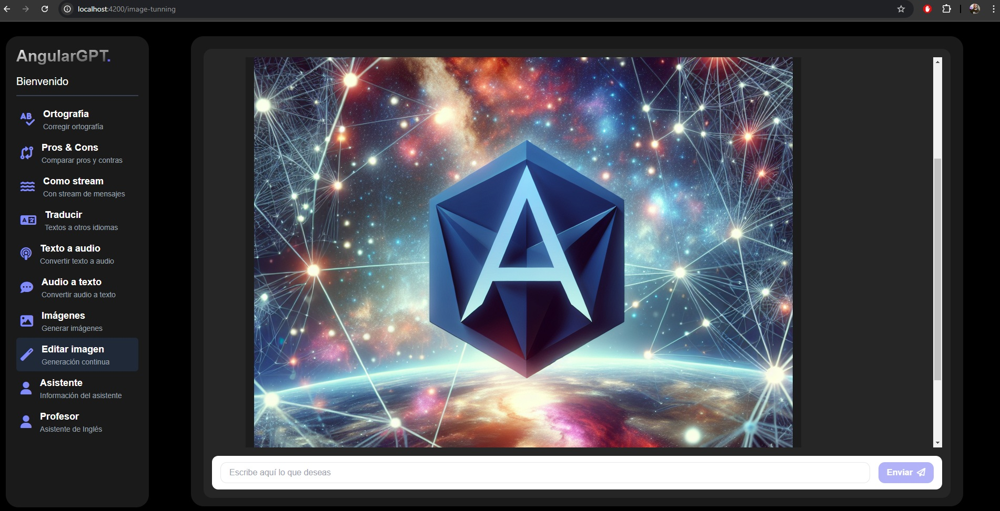

# AngularOpenai

This project was generated using [Angular CLI](https://github.com/angular/angular-cli) version 19.1.2.

## Development server

Steps to run in dev:

1. Install dependencies with `npm install`
2. Run `ng serve` to start the development server.
3. Navigate to `http://localhost:4200/`

## Backend Repo:
`https://github.com/adriandy89/nest-openai`
